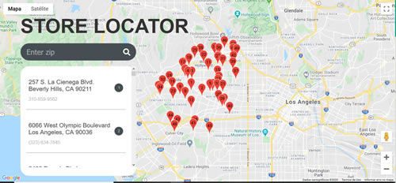

# Store Locator
> Javascript project using the Google Maps API.


Find stores according to your ZIP Code.


## Usage example

You must include your Google MAPS API key in the index.html file.

```html
<script async defer 
    src="https://maps.googleapis.com/maps/api/js?key=<GOOGLE_API>&callback=initMap"></script>
```
If you don't have a Google API key, you can generate one from the address:

https://cloud.google.com/api-keys/docs/get-started-api-keys


## Results

The rederization will be as shown in the image:





## Store Locate Data

The information used in the example is contained in the file:

js/store-data.js

